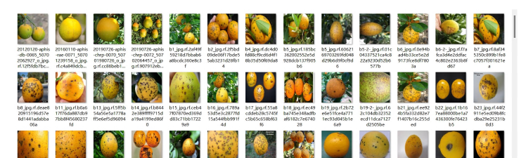

# Citrus Defect Detection Dataset for Object Detection

44.07MB in ZIP format  
YOLO and VOC-style citrus defect detection datasets suitable for training with YOLO series, Faster RCNN, SSD, etc., containing 4 categories: Orange-Green-Black-Spot, Orange-Black-Spot, Orange-Canker, 
Orange-Healthy. The dataset consists of 1290 images.  
The files include images, txt labels, a YAML file specifying the category information, and XML tags. Images and txt labels have been divided into training sets, validation sets, and test sets, which 
can be directly used for training with YOLOv5, YOLOv6, YOLOv7, YOLOv8, YOLOv9, YOLOv10 and other YOLO series algorithms.  
Number of annotations: 4  
Names of annotated categories: ['Orange-Green-Black-Spot', 'Orange-Black-Spot', 'Orange-Canker', 'Orange-Healthy']  
Index	Category name	Images	Boxes  
1	Orange-Green-Black-Spot	374	382  
2	Orange-Black-Spot	406	485  
3	Orange-Canker	240	277  
4	Orange-Healthy	272	318  
Annotation tools used: labelImg  
Annotation rules: draw horizontal boxes around the categories  
Example of an image:
## Images

Here is a pay link on Stripe ( https://buy.stripe.com/3cs8yP7sY87d0vu9AB ). Please contact me lonlonago@foxmail.com after funding $89, and I will send you a complete data files , thank you!

